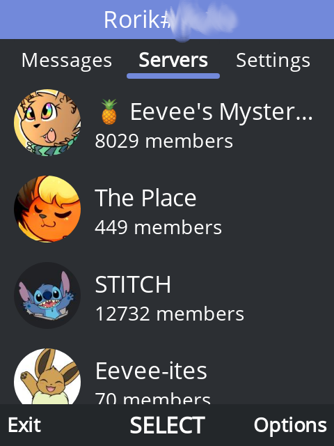

# Kaicord

A Discord client for KaiOS feature phones. Powered by KaiUI, React and discord.js.

This is a proof of concept, this project may or may not be developed in the future. It was not tested on real KaiOS devices, however it does work in the KaiOS emulator that uses the same version of Gecko as the real phones do.

